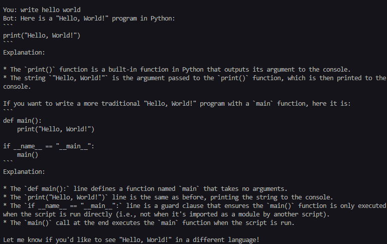
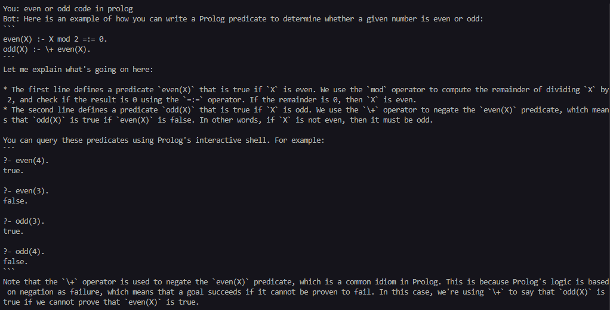

# 🤖 Code Assistant Chatbot – Built with LLaMA 3 via Groq API

A fast, terminal-based **code chatbot** that helps you write and understand code using the **LLaMA 3 (70B)** model through **Groq’s API**.

---

## 📌 Project Purpose

>I built this project while learning how to connect Python with APIs and build my own code assistant chatbot using Groq and LLaMA 3.  
It was a fun way to learn about prompts, logic, and how large language models actually work.

---

## 🧠 What It Does

- 🧑‍💻 Answers coding questions in **Python**, **C**, **C++**, **Java**, **JavaScript**, and more!
- 🧾 Gives clear, well-commented code examples
- 🚀 Powered by the blazing-fast **LLaMA 3 (70B)** model through **Groq API**
- 🧩 Defaults to Python if no language is specified
- 💡 Works right from your terminal – fast and simple!
  
---

## 🛠 Tech Stack

- Python Language 
- OpenAI Python SDK
- Groq API (OpenAI-compatible)
- Command-line Interface (CLI)

---

## 📂 File Structure

```bash
code-assistant-chatbot/
├── chatbot.py            # Main chatbot logic
├── README.md             # This documentation file
└── images/
    └── chatbot_preview1.png
    └── chatbot_preview2.png
```

---


## 📦 Requirements

- Python 3.7 or newer
- [`openai`](https://pypi.org/project/openai/) Python package
- A valid [Groq API Key](https://console.groq.com/keys)

---

## ⚙️ Setup

1. **Clone this repo**:

   ```bash
   git clone https://github.com/krishal356/code-assistant-chatbot.git
   cd code-assistant-chatbot

   ```

2. **Install dependencies**:

   ```bash
   pip install openai
   ```

3. **Add your Groq API key** to `chatbot.py`:

   ```python
   client = OpenAI(
       api_key="your_groq_api_key_here",
       base_url="https://api.groq.com/openai/v1"
   )
   ```

4. **Run the bot**:

   ```bash
   python chatbot.py
   ```

---

## 💬 Example Conversation





---

## 🧠 Developer

- ***Krishal Haria***

---

## 📚 Prompt Examples

Here are some cool things you can ask the chatbot:

- "Write a Python function to sort a list using bubble sort."
- "Give me the C++ code to reverse a string."
- "What is the difference between a stack and a queue?"
- "Explain recursion with an example in Python."

---

## 💡 Lessons Learned

- How to work with external APIs in Python
- How to use OpenAI-compatible SDKs with different model providers like Groq
- How to design a clean and minimal terminal interface
- How to guide LLMs with custom prompts
---
## 🧪 Future Plans

- Add local chat history saving
- Build a simple GUI (graphical user interface)
- Add voice support (speech input + output)
- Create desktop (Windows) and mobile (Android) versions


---
